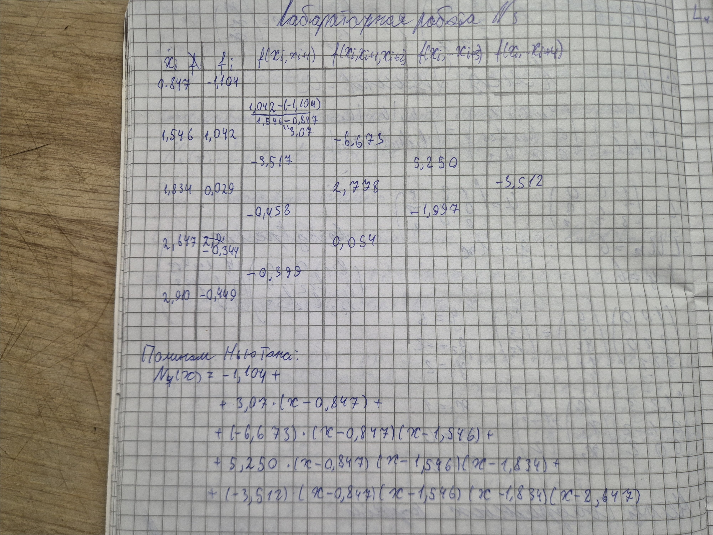
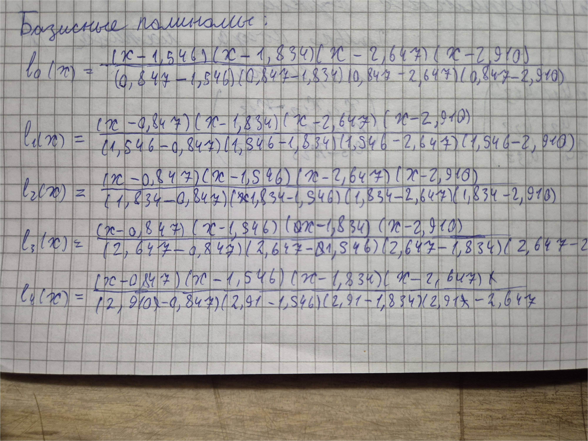
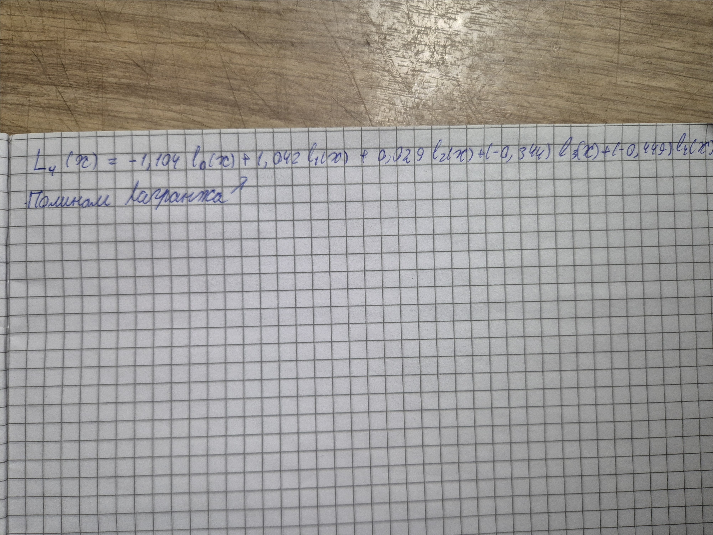

# Лабораторная работа №3

## Интерполяционные многочлены Ньютона и Лагранжа

**Выполнил:** Anisimov Victor  
**Группа:** IA2403  

## Введение

Интерполяция является важным инструментом численного анализа и применяется для построения функции, проходящей через заданный набор точек. Это позволяет приближённо восстанавливать неизвестные значения функции на основе известных данных.

В данной работе рассматриваются два классических метода интерполяции: многочлен Лагранжа и многочлен Ньютона. Основной целью является построение указанных интерполяционных многочленов по заданным точкам.

## Теоретическая часть

### Многочлен Лагранжа

Интерполяционный многочлен Лагранжа строится в виде линейной комбинации базисных полиномов. Его общий вид:

$$
L(x) = \sum_{i=0}^{n} y_i \cdot l_i(x)
$$

где базисный полином:

$$
l_i(x) = \prod_{\substack{j=0 \\ j \ne i}}^{n} \frac{x - x_j}{x_i - x_j}
$$

Данный метод позволяет напрямую записать многочлен через заданные точки без предварительных вычислений вспомогательных коэффициентов.

### Многочлен Ньютона

Многочлен Ньютона строится с использованием разделённых разностей и имеет вид:

$$
P(x) = a_0 + a_1(x - x_0) + a_2(x - x_0)(x - x_1) + \dots
$$

Коэффициенты \(a_i\) вычисляются через таблицу разделённых разностей. Такой подход позволяет удобно добавлять новые точки без полного пересчёта многочлена.

## Практичекское применение методов

## Сравнительная характеристика методов

Многочлены Лагранжа и Ньютона решают одну и ту же задачу, однако делают это различными способами.

Метод Лагранжа является более наглядным и простым для понимания, так как формула сразу задаёт итоговый многочлен. Однако при добавлении новой точки требуется полностью перестраивать весь многочлен.

Метод Ньютона, напротив, более гибкий. Благодаря использованию разделённых разностей можно постепенно дополнять многочлен новыми членами без пересчёта уже найденных коэффициентов. Это делает его более удобным в практических вычислениях.

## Заключение

В ходе работы были построены интерполяционные многочлены Лагранжа и Ньютона по заданным точкам. Оба метода позволяют получить один и тот же результат, однако отличаются подходом к построению.
